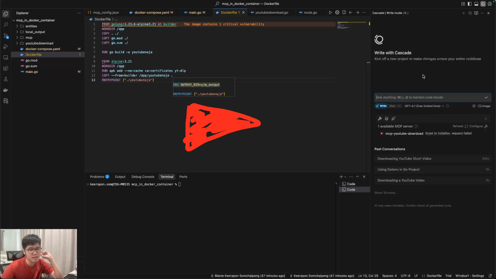

# 🚨 **ข้อควรระวัง (IMPORTANT NOTE)** 🚨

**Dockerfile** มีการนำ `yt-dlp` ที่อยู่ในเครื่องของคุณ เข้าไปในขั้นตอน build ด้วย!

👉 **ดังนั้น คุณต้องดาวน์โหลด binary ของ `yt-dlp` มาก่อน**

- วิธีการดาวน์โหลด yt-dlp binary:
  - ดูรายละเอียดได้ที่ [yt-dlp GitHub](https://github.com/yt-dlp/yt-dlp)

**หากไม่มีไฟล์ `yt-dlp` ในเครื่อง จะไม่สามารถ build Docker image ได้!**

คลิปอธิบาย

